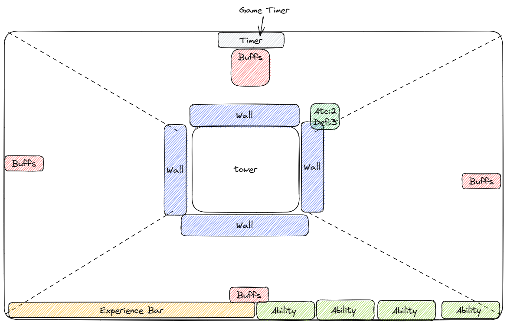

# MAD CRABS GAME

## Overview

### Theme
Side effects

## Genre
- Tower Defense
    - Castle in the center which you have to defend
- Vampire Survivors
    - Waves of monsters that come from all sides

### Concept
- There is a castle in the center of the map
- Castle has 4 walls, one wall for each screen side (north, south, west, east)
- Each wall has its own stats (damage, defence, health)
- Map is divided into 4 sections, one for each wall
- Enemies come from from all 4 sides
- Each wall is responsible for its own side
- Walls kill enemies (Archers, catapults)
- Enemies give experience upon death
- Castle levels up with experience
- Upon reaching new level player has a choise of several upgrades
- Each upgrade has side effect associated with it
- Castle itself has several abilities it can use on any side
- Castle abilities have cooldowns

### Feel
We would like it to be an intense experience
It is a survival game

### Aesthetic
- medieval assets
- pixel art

## Game
### Modes and objectives
- Normal mode: hold the castle for 30 minutes to win
- Infinite mode: hold for as long as possible

### Progression
#### In session
- Enemies drop experience with which castle levels up
- Level ups give a choise of 4 upgrades, each upgrade associated with its side/wall
- Each upgrade have side effects

#### Across the sessions
- New types of castles are being unlock

### Duration
- Normal mode: 30 minutes
- Infinite mode: infinite

### Difficulty
Rises as time pases

### Loops
- Kill enemies -> get experience -> level up -> upgrade

## Interface
### Input
- Mouse for hud
- Keybinds for castle abilities

### HUD
- Timer
- Castle experience bar
- Walls health
- Buffs/Debuffs for each side

### GUI

## Resources used
[Project template](doc/template.md)
